## Physical assembly of your RaspiBlitz

Check you have all the parts
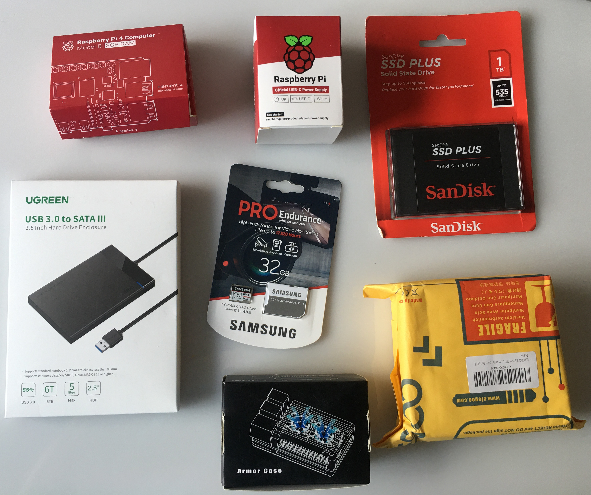

The Armor Case box should have at least these items. There'll be others that we can ignore for the moment
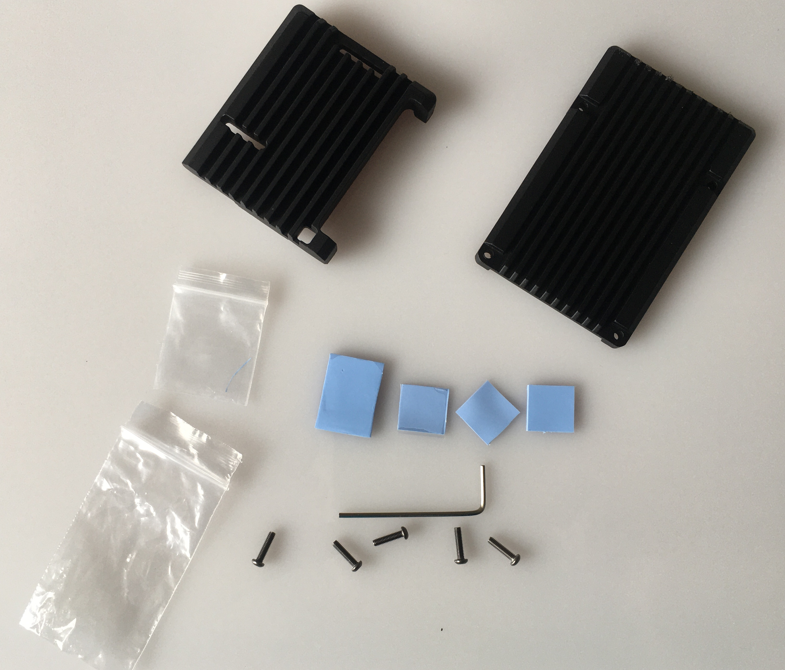

The thermal tape has plastic backing on both sides - remember to remove both as you use them
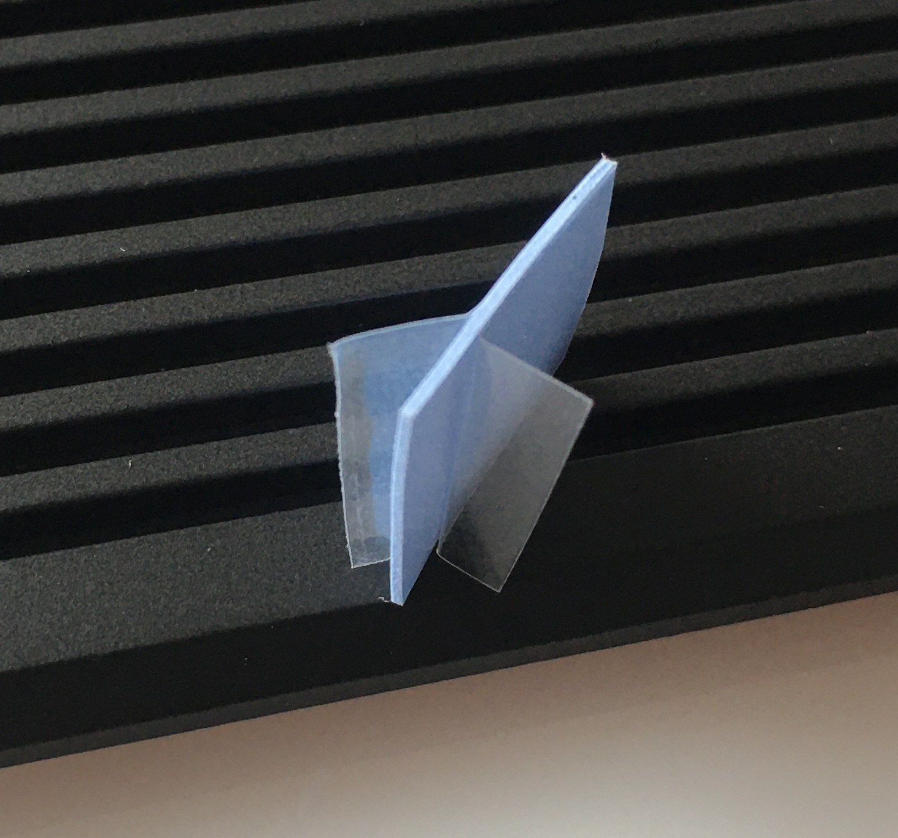

Take out the Raspberry PI board and using a small square of thermal tape, and the larger oblong, cover the chips as so
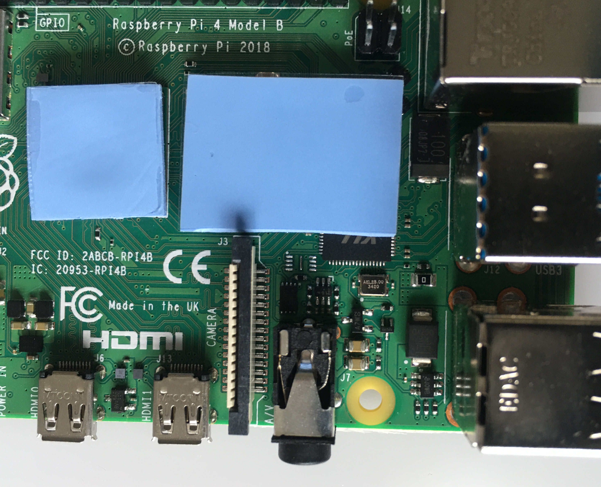

There are two remaining thermal pads. Attach them one on top of the other to the visible square on the Armor Case's lower section
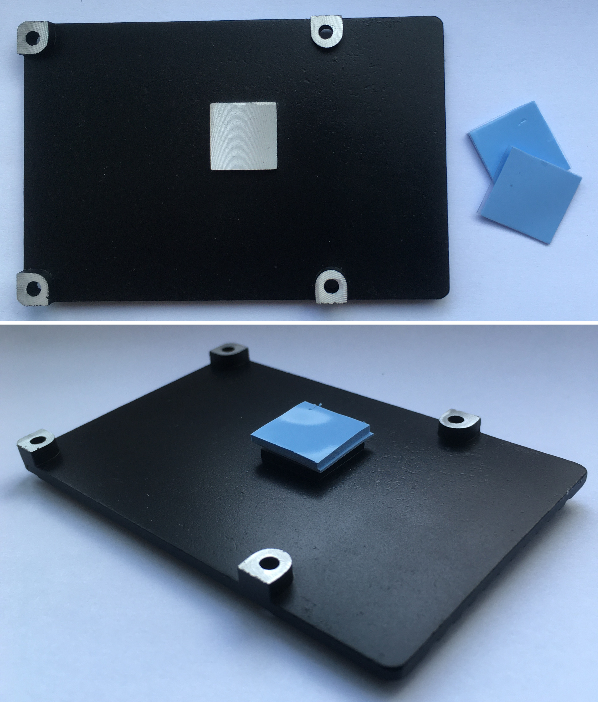

Now use four screws to clamp the Armor Case around the Raspberry Pi. Additional screws can be discarded
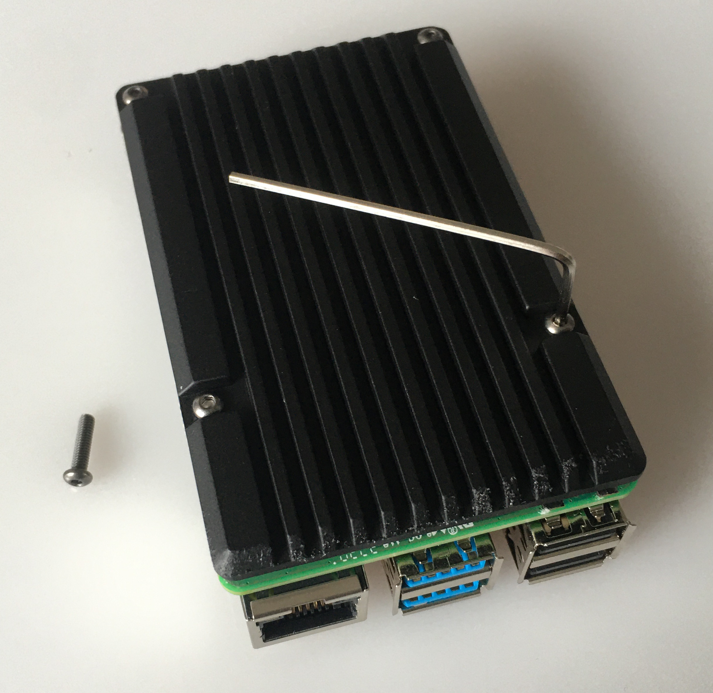

Slide open the enclosure on its underside to reveal the SATA connector, slide in the SSD then close the enclosure. Attach the enclosure to one of the Raspberry Pi's blue USB ports
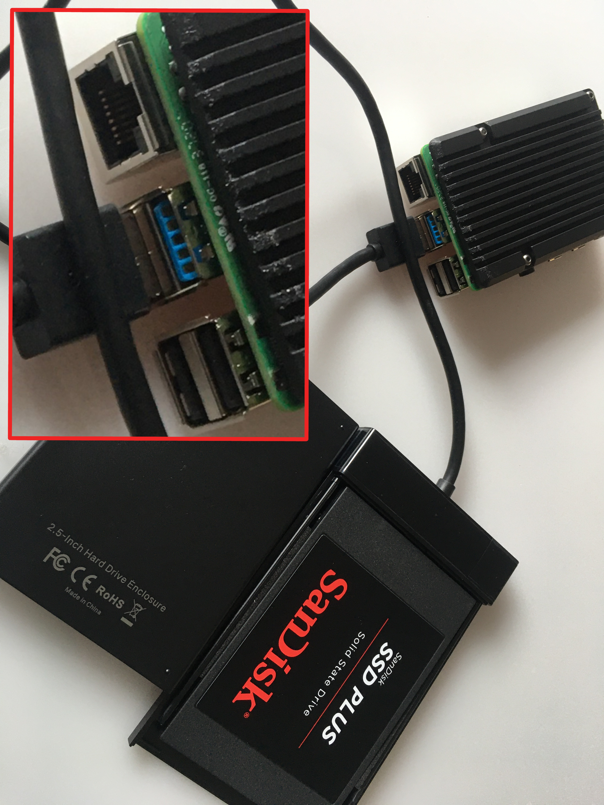

Optional: attach the display. Be careful to align the connectors all the way to to the right
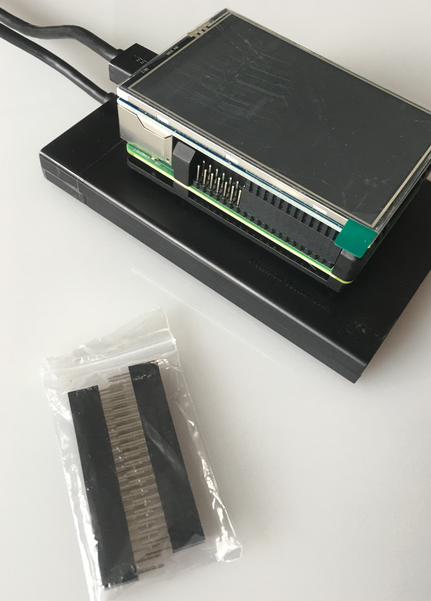

Attach the USB-C power lead and turn on at the wall. Note there's no "on" switch on the plug or the Raspberry Pi. You should see the red and green leds solidly on; the blue led on the enclosure will blink intermittently.
Without optional display:
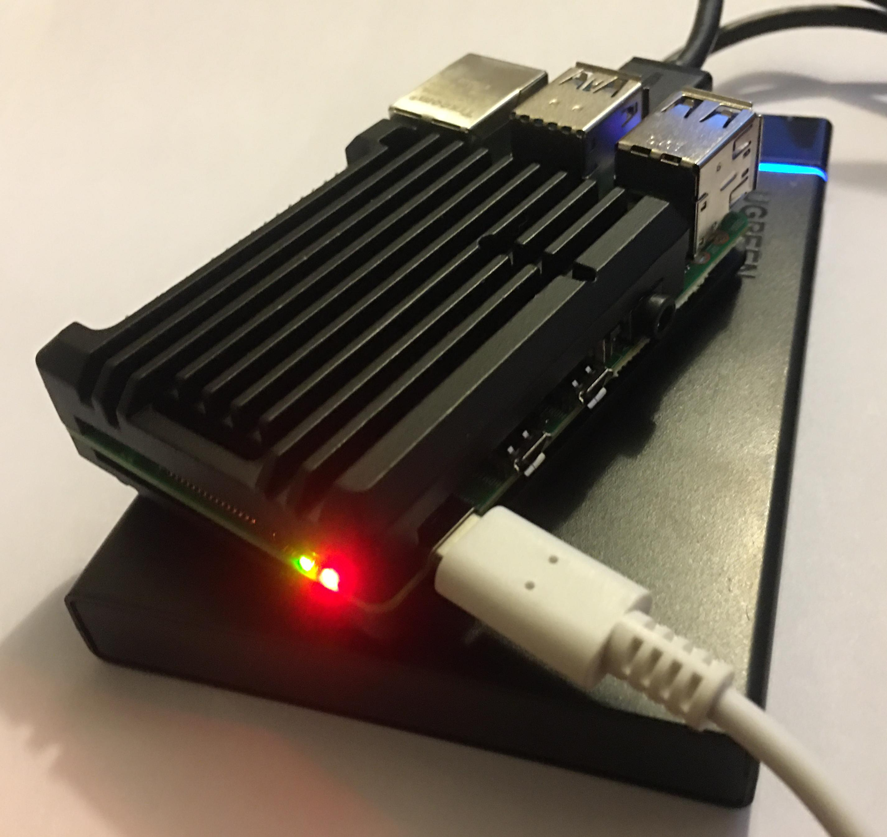

With optional display, which will be solid white:
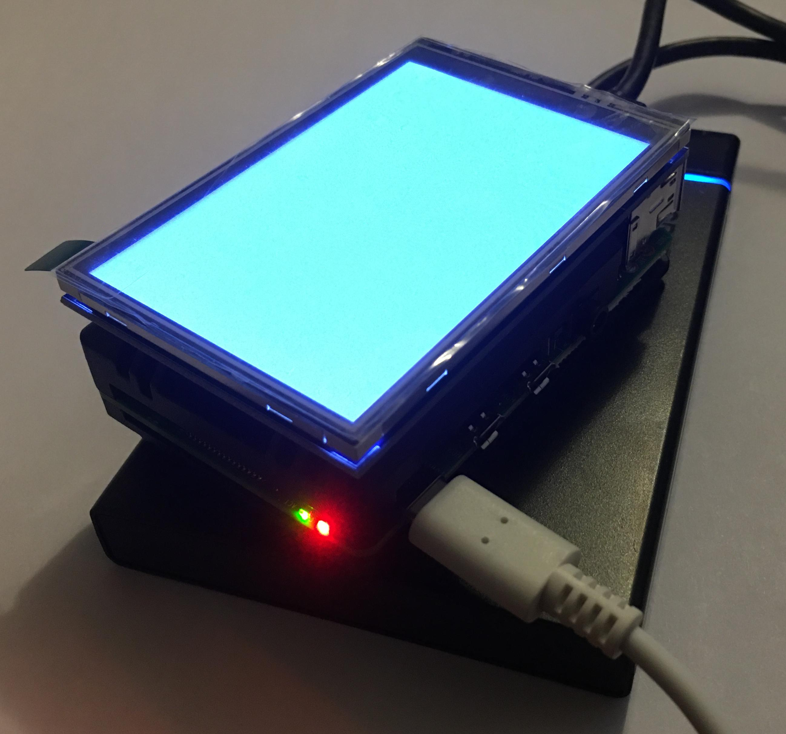

Optional: Connect the network cable, unless you plan to use wifi
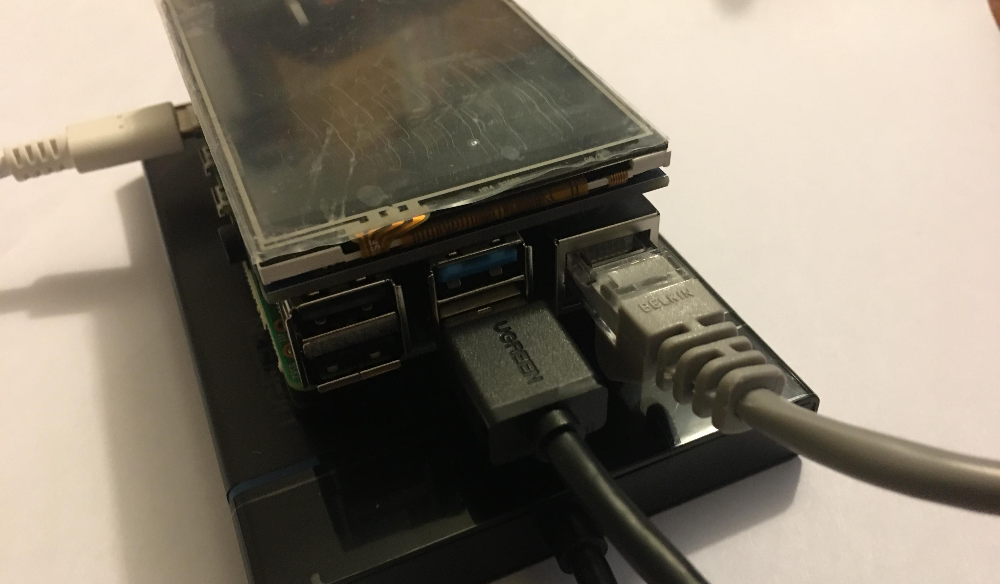

Unplug the Raspberry Pi's power supply for now.
